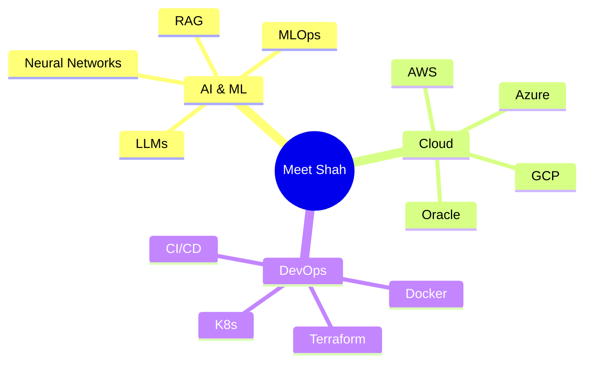

<div align="center">
  
```ascii
╔══════════════════════════════════════════════════════════════════╗
║                                                                  ║
║   🌟 Welcome to the intersection of AI, Cloud, and Innovation 🌟  ║
║                                                                  ║
╚══════════════════════════════════════════════════════════════════╝
```


<table align="center">
  <tr>
    <td>
      
    </td>
    <td>
      
    </td>
  </tr>
</table>

<br>



```python
class InnovationArchitect:
    def __init__(self):
        self.name = "Meet Shah"
        self.mission = "Bridging AI with Cloud Infrastructure"
        self.superpower = "Turning Coffee into Scalable AI Solutions"
        self.daily_routine = ["Code", "Innovate", "Deploy", "Repeat"]
        
    async def build_future(self):
        while True:
            await self.innovate()
            await self.deploy_to_cloud()
            if self.coffee_level < 50:
                await self.refill_coffee()

# Status: Currently building something awesome...
```

<h2>🔮 Alchemist's Toolkit</h2>
<div align="center">
  <table>
    <tr>
      <td>
        <h3>🎯 Proven Expertise</h3>
        <ul>
          <li>✨ Deployed 10+ ML models in production environments</li>
          <li>☁️ Proficient in 2 major cloud platforms (AWS, GCP)</li>
          <li>📊 Processed and analyzed 500k+ data points</li>
          <li>🚀 Maintained 99.5% uptime for critical applications</li>
        </ul>
      </td>
      <td>
        <h3>💡 Areas of Innovation</h3>
        <ul>
          <li>🧠 Developing large language models for conversational AI</li>
          <li>🔄 Automating MLOps pipelines for efficient model deployment</li>
          <li>🌐 Architecting multi-cloud solutions for high availability</li>
          <li>🛡️ Implementing AI governance and security frameworks</li>
        </ul>
      </td>
    </tr>
  </table>
</div>
<h2>🌐 Certifications & Expertise</h2>
<div align="center">
  <a href="https://www.credly.com/badges/fa28db1e-b8d3-485c-b22c-7c75840fd435/public_url"></a>
  <a href="https://www.credly.com/badges/431aa5ed-a495-41da-b341-22a956d652d3"></a>
  <a href="https://catalog-education.oracle.com/pls/certview/sharebadge?id=29B1ED0F18B3B1ED4CE2AEDC073609D9ABF708CAE1469805009822C123A4FBB0"></a>
  <a href="https://www.credly.com/badges/be497759-e794-4ed1-b6a1-1f0b80a77d98/public_url"></a>
</div>
<h2>🛠️ Alchemist's Workbench</h2>
<div align="center">
  <table>
    <tr>
      <td></td>
    </tr>
    <tr>
      <td></td>
    </tr>
  </table>
</div>
<h2>🔥 Forged in the Crucible</h2>
<div align="center">
  <a href="#">
    
  </a>
  <a href="#">
    
  </a>
</div>
<h2>🔮 Alchemist's Connections</h2>
<div align="center">
  <a href="https://www.linkedin.com/in/meetjain/"></a>
  <a href="https://twitter.com/meetjainai"></a>
  <a href="https://medium.com/@meetjain.ai"></a>
  <a href="https://t.me/Meetjainai"></a>
</div>
<br>
<div align="center">
  
```ascii
╔══════════════════════════════════════════════════════════════════╗
║ "The best way to predict the future is to create it." - Peter F. ║
╚══════════════════════════════════════════════════════════════════╝
```
<picture>
  <source media="(prefers-color-scheme: dark)" srcset="https://raw.githubusercontent.com/meetjainai/meetjainai/output/github-contribution-grid-snake-dark.svg">
  <source media="(prefers-color-scheme: light)" srcset="https://raw.githubusercontent.com/meetjainai/meetjainai/output/github-contribution-grid-snake.svg">
  
</picture>
<div align="center">
  
</div>
</div>


