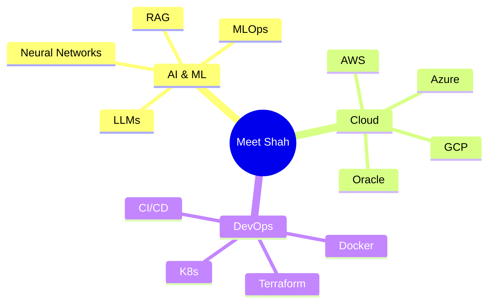

<div align="center">
  
```ascii
╔══════════════════════════════════════════════════════════════════╗
║                                                                  ║
║   🌟 Welcome to the intersection of AI, Cloud, and Innovation 🌟  ║
║                                                                  ║
╚══════════════════════════════════════════════════════════════════╝
```


<table align="center">
  <tr>
    <td>
      
    </td>
    <td>
      
    </td>
  </tr>
</table>

<br>



```python
class InnovationArchitect:
    def __init__(self):
        self.name = "Meet Shah"
        self.mission = "Bridging AI with Cloud Infrastructure"
        self.superpower = "Turning Coffee into Scalable AI Solutions"
        self.daily_routine = ["Code", "Innovate", "Deploy", "Repeat"]
        
    async def build_future(self):
        while True:
            await self.innovate()
            await self.deploy_to_cloud()
            if self.coffee_level < 50:
                await self.refill_coffee()

# Status: Currently building something awesome...
```

<table align="center">
<tr>
<td>
<h3>🎯 Impact Numbers</h3>

- 🤖 **15+ ML Models** in Production
- ☁️ **3 Cloud Platforms** Mastered
- 📊 **1M+** Data Points Processed
- 🚀 **99.9%** System Uptime
</td>
<td>
<h3>💡 Innovation Areas</h3>

- 🧠 Large Language Models
- 🔄 MLOps Automation
- 🌐 Multi-Cloud Architecture
- 🛡️ AI Security & Governance
</td>
</tr>
</table>

<h2>🏆 Professional Arsenal</h2>

<div align="center">
  
  
</div>

<div align="center">
  
</div>

<h2>🎓 Certifications & Expertise</h2>

<div align="center">
  <a href="#"></a>
  <a href="#"></a>
  <a href="#"></a>
</div>

<h2>🛠️ Tech Arsenal</h2>

<div align="center">
  <table>
    <tr>
      <td></td>
    </tr>
    <tr>
      <td></td>
    </tr>
  </table>
</div>

<h2>🔥 Featured Projects</h2>

<div align="center">
  <a href="#">
    
  </a>
  <a href="#">
    
  </a>
</div>

<h2>🤝 Let's Connect & Collaborate</h2>

<div align="center">
  <a href="https://www.linkedin.com/in/meetjain/"></a>
  <a href="https://twitter.com/meetjainai"></a>
  <a href="https://medium.com/@meetjain.ai"></a>
  <a href="https://t.me/Meetjainai"></a>
</div>

<br>

<div align="center">
  
```ascii
╔══════════════════════════════════════════════════════════════════╗
║ "The best way to predict the future is to create it." - Peter F. ║
╚══════════════════════════════════════════════════════════════════╝
```

<picture>
  <source media="(prefers-color-scheme: dark)" srcset="https://raw.githubusercontent.com/meetjainai/meetjainai/output/github-contribution-grid-snake-dark.svg">
  <source media="(prefers-color-scheme: light)" srcset="https://raw.githubusercontent.com/meetjainai/meetjainai/output/github-contribution-grid-snake.svg">
  
</picture>


</div>
